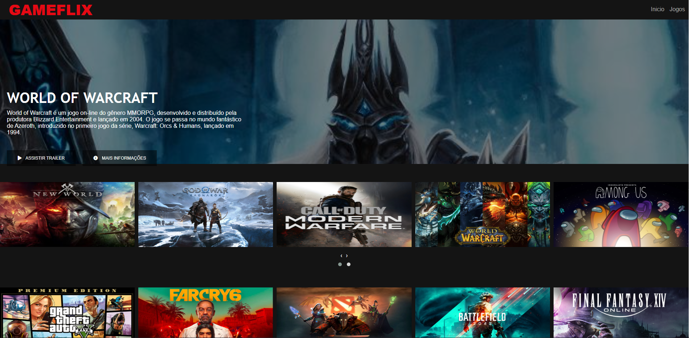

# GAMEFLIX

DIO - Digital Innovation One

<p align="center">
  

</p>

## :bookmark: About the project

A complete website, created copying the aspects of Netflix, changed to show some really cool games.

## 🚀 Technologies

Technologies that I used to develop this web client

- [JSON Server](https://github.com/typicode/json-server)
- JavaScript
- HTML
- CSS

## 💻 Getting started

### Requirements

**Clone the project and access the folder**

```bash
$ git clone https://github.com/igormazetti/gameflix.git
```

Made by Igor Mazetti 👋 [See my linkedin](https://www.linkedin.com/in/igor-mazetti-de-azevedo-147679ba/)
